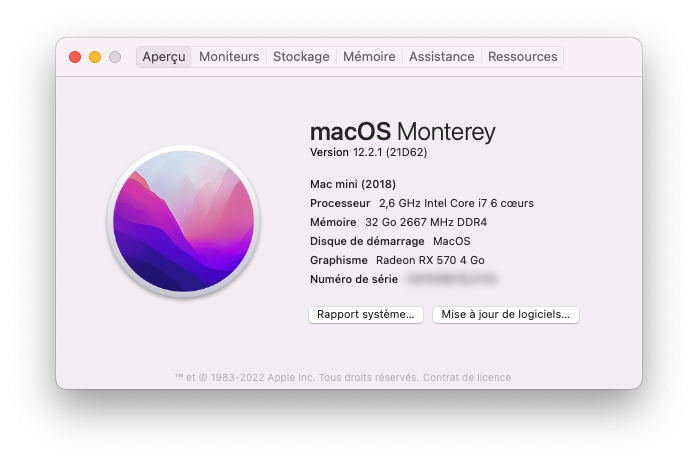

# Hackintosh NUC9I7QNX OpenCore

> I love Mac OS and I use it for years. I could buy a Mac Mini M1, but I wont buy an unrepairable and unupgradable desktop computer. I expect durable computers, as much as I can. 

## System Specification
- Processor: Intel® Core™ i7-9750H Processor (6 cores, 12 MB Cache, 2.6 GHz to 4.50 GHz)
- Memory: G.Skill RIPJAWS 2x16 GB 2666 MHz DDR4
- Graphics: Sapphire Pulse `RX 570` 4GB ITX + Built-in Intel `UHD Graphics 630` 2048 MB
- Main Hard Disk: NVMe Samsung EVO 970 500 GB
- Secondary Hard Disk: M.2 Sata Sandisk 500GB 
- Wifi/BT: Built-in `Intel AX200`
- Audio: Built-in `Realtek ALC256`

## OpenCore
- Version: [0.6.8](https://github.com/acidanthera/OpenCorePkg/releases/tag/0.6.8)
- Generate SMBios using `Macmini8,1` type and add to `config.plist > PlatformInfo > Generic`

## Bios Settings
- BIOS Version: `QXCFL579`
- First, restore default BIOS config: `F9 - Optimal Defaults`

### Configuration
- Advanced
  - USB > `Legacy USB Support: Enabled`
- Security
  - Security Features > `Intel Platform Trust Technology: Unchecked`
  - Security Features > `Intel Software Guard Extension (SGX): Disabled`
  - Security Features > `Thunderbold Security Level: Legacy mode`
- Boot
  - Secure Boot > `Secure Boot: Disabled`
  - boot Priority > `Fast Boot: Unchecked`
  - boot Priority > `Network Boot: Disabled`
  - boot Priority > `Ethernet1 Boot: Unchecked`
  - boot Priority > `Ethernet2 Boot: Unchecked`

## Hardware

* [x] GPU acceleration: built-in `Intel UHD 630` 
* [x] GPU acceleration: `RX 570` (out of the box)
* [x] Ethernet
* [x] Audio (Front Panel Headphone)
* [x] Audio (Rear Panel Headphone)
* [x] USB A ports
* [x] SD card slot
* [x] NVMe SSD
* [x] Wifi :zap:
* [x] Bluetooth :zap:
* [x] USB C ports
* [x] Airpods Pro (battery level/noise reduction mode switch)
* [x] CPU power management (tested using Intel Power Gadget)

## Software

* [x] Installer, App Store, App updates
* [x] Update MacOS directly from Apple
* [x] APFS, SSD TRIM
* [x] iMessage, iCloud, Siri, iTunes, other services
* [ ] Handoff, Continuity, Universal Clipboard
* [x] Metal, GPU accelerated applications: built-in `Intel UHD 630`
* [x] Metal, GPU accelerated applications: `RX 570`
* [x] Time Machine
* [x] Sleep mode
* [x] Shutdown/Sleep/Wake
* [x] Schedule Start up or Wake
* [X] Screenshare (VNC)
* [ ] Wake On Screenshare

## :zap: Errors and other

* Could not add MX Keys for Mac keyboard using Bluetooth, nothing happened after adding the code, I had to use Unifying dongle
* Could not add MX Master using Bluetooth
* Built-in wifi connect on 5Ghz network but does not uses ac protocol:  
  
* Speedtest:  
  

## :zap: MacOS Big Sur 11.3

* No USB after update, to fix it:
  * Enable `config.plist` > `Kernel` > `Add` > `USBInjectAll` kext
  * Disable `config.plist` > `Kernel` > `Add` > `USBMap` kext
  * Disable `config.plist` > `Kernel` > `Quirks` > `XhciPortLimit`

## Not tested Hardware
* Audio (Microphone, Toslink)
* HDMI/DP audio
* Video encoder/decoder hardware
* Multiple displays
* Thunderbolt 3 port
* Secure Boot (with High Security)

## Not tested  Software
* FileVault2
* SIP, Gate Keeper, all OSX security features

## OS Version Tested
- `[update]` MacOS Big Sur 11.3 (20E232)
- `[install]` MacOS Big Sur 11.2.3 (20D91)

## Tools
- [MountEFI tool](https://github.com/corpnewt/MountEFI)
- [GenSMBIOS tool](https://github.com/corpnewt/GenSMBIOS)
- [ProperTree tool](https://github.com/corpnewt/ProperTree)
- [USBMap tool](https://github.com/corpnewt/USBMap)
- [OCConfigCompare](https://github.com/corpnewt/OCConfigCompare)
- [gfxutil](https://github.com/acidanthera/gfxutil)

## Kexts
- [Lilu v1.5.2](https://github.com/acidanthera/Lilu/releases/tag/1.5.2)
- [VirtualSMC v1.2.2](https://github.com/acidanthera/VirtualSMC/releases/tag/1.2.2)
- [WhateverGreen v1.4.9](https://github.com/acidanthera/WhateverGreen/releases/tag/1.4.9)
- Audio: [AppleALC v1.5.8](https://github.com/acidanthera/AppleALC/releases/tag/1.5.8)
- LAN: [IntelMausi v1.0.5](https://github.com/acidanthera/IntelMausi/releases/tag/1.0.5)
- LAN i211: [SmallTreeIntel82576 v1.2.5](https://github.com/khronokernel/SmallTree-I211-AT-patch/releases/tag/1.2.5)
- Bluetooth: [IntelBluetoothFirmware v1.1.2](https://github.com/OpenIntelWireless/IntelBluetoothFirmware/releases/tag/1.1.2)
- Built-in Wifi: [AirportItlwm v1.2.0](https://github.com/OpenIntelWireless/itlwm/releases/tag/v1.2.0)
- USB: [USBInjectAll v2018-1108](https://bitbucket.org/RehabMan/os-x-usb-inject-all/downloads/?tab=downloads)
- NVMe: [NVMeFix v1.0.5](https://github.com/acidanthera/NVMeFix/releases/tag/1.0.5)

## Resources
- [OpenCore Sanity Checker](https://opencore.slowgeek.com)
- [PcPerspective - Nuc9 Chipset](https://pcper.com/2020/04/intel-nuc-9-extreme-nuc9i9qnx-review/#ftoc-heading-19)
- [OpenCore Guide - config.plist](https://dortania.github.io/OpenCore-Install-Guide/config-laptop.plist/coffee-lake-plus.html#starting-point) 
- [OpenCore Guide - Generate SMBios](https://dortania.github.io/OpenCore-Install-Guide/config-laptop.plist/coffee-lake-plus.html#platforminfo)
- [OpenCore Guide - Choosing the right SMBios](https://dortania.github.io/OpenCore-Install-Guide/extras/smbios-support.html#how-to-decide)
- [OpenCore Guide - HDD boot](https://dortania.github.io/OpenCore-Post-Install/universal/oc2hdd.html#grabbing-opencore-off-the-usb)
- [OpenCore Guide - Debug Mode](https://dortania.github.io/OpenCore-Install-Guide/troubleshooting/debug.html)
- [OpenCore Guide - Update OpenCore](https://dortania.github.io/OpenCore-Post-Install/universal/update.html#_2-mount-your-efi)
